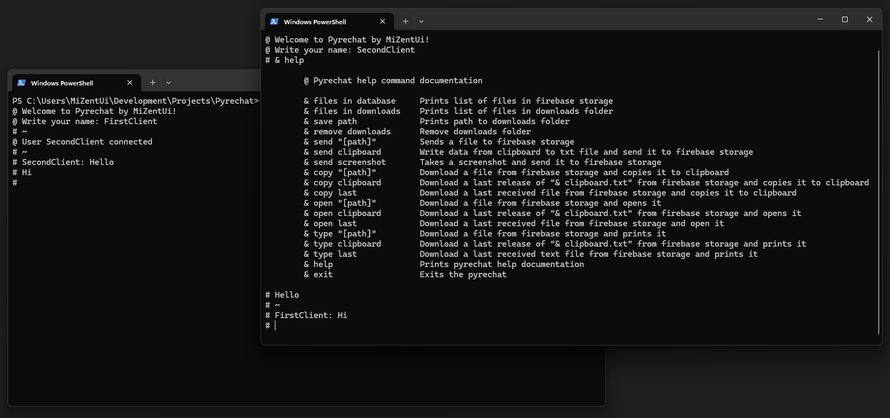

# Pyrechat



Pyrechat is a simple console chat with extra features.

**Main features**

- File exchange
- Sending clipboard contents
- Quick screenshot sharing

## Table of Contents

- [Install](#install)
	- [Firebase setup](#firebase-setup)
- [Usage](#usage)
	- [Сommand list](#сommand-list)
- [License](#license)

## Install

This project requires [Python 3](https://www.python.org/) and a [Firebase Project](https://firebase.google.com/).

```
git clone https://github.com/MiZentUi/Pyrechat.git
cd Pyrechat
pip install -r requirements.txt
```

### Firebase setup

1. [Create a Firebase project](https://firebase.google.com/docs/database) with Realtime Database and Storage enabled.
2. Set the Realtime Database rules. **Note: your database will not be secure after this.**

```json
{
  "rules": {
    ".read": true,
    ".write": true
  }
}
```

3. Create a file named `firebase-secrets.json`, paste your Firebase secrets into it, and place it in the same directory as `pyrechat.py`.

Example `firebase-secrets.json`:

```json
{
	"apiKey": "...",
	"authDomain": "...",
	"databaseURL": "...",
	"storageBucket": "...",
	"serviceAccount": {
		"type": "service_account",
		"project_id": "...",
		"private_key_id": "...",
		"private_key": "...",
		"client_email": "...",
		"client_id": "...",
		"auth_uri": "...",
		"token_uri": "...",
		"auth_provider_x509_cert_url": "...",
		"client_x509_cert_url": "...",
		"universe_domain": "..."
	}
}
```

## Usage

```
python pyrechat.py
```

Each message is sent after pressing `Enter`.

Commands start with `& `. For example: `& help`.

### Сommand list

| Command                | Description                                                                                  |
| ---------------------- | -------------------------------------------------------------------------------------------- |
| `& files in database`  | Prints list of files in firebase storage                                                     |
| `& files in downloads` | Prints list of files in downloads folder                                                     |
| `& save path`          | Prints path to downloads folder                                                              |
| `& remove downloads`   | Remove downloads folder                                                                      |
| `& send "[path]"`      | Sends a file to firebase storage                                                             |
| `& send clipboard`     | Write data from clipboard to txt file and send it to firebase storage                        |
| `& send screenshot`    | Takes a screenshot and send it to firebase storage                                           |
| `& copy "[path]"`      | Download a file from firebase storage and copies it to clipboard                             |
| `& copy clipboard`     | Download a last release of `& clipboard.txt` from firebase storage and copies it toclipboard |
| `& copy last`          | Download a last received file from firebase storage and copies it to clipboard               |
| `& open "[path]"`      | Download a file from firebase storage and opens it                                           |
| `& open clipboard`     | Download a last release of `& clipboard.txt` from firebase storage and opens it              |
| `& open last`          | Download a last received file from firebase storage and open it                              |
| `& type "[path]"`      | Download a file from firebase storage and prints it                                          |
| `& type clipboard`     | Download a last release of `& clipboard.txt` from firebase storage and prints it             |
| `& type last`          | Download a last received text file from firebase storage and prints it                       |
| `& help`               | Prints pyrechat help documentation                                                           |
| `& exit`               | Exits the pyrechat                                                                           |

## License

[GPL © Denis Skrobot](LICENSE)